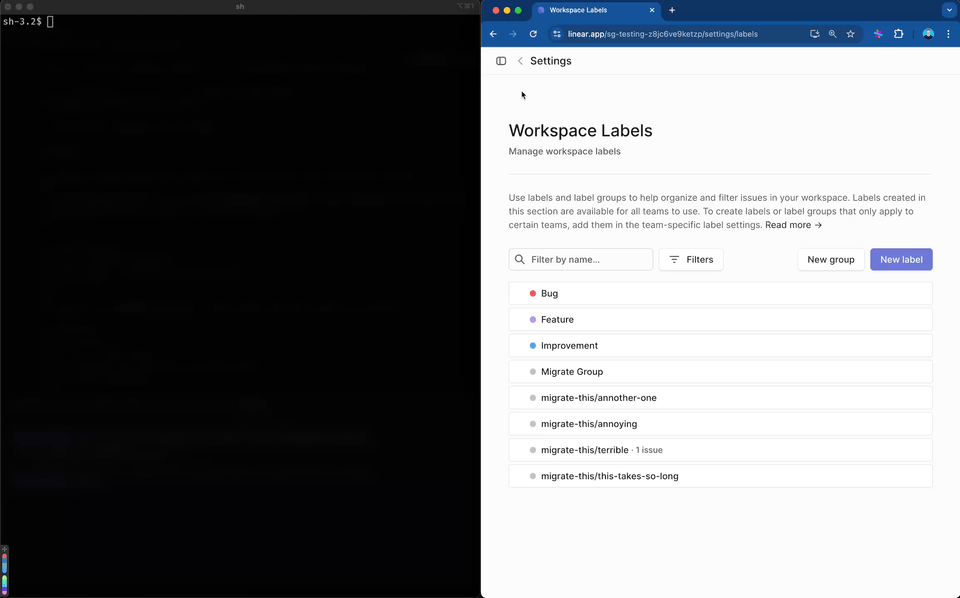
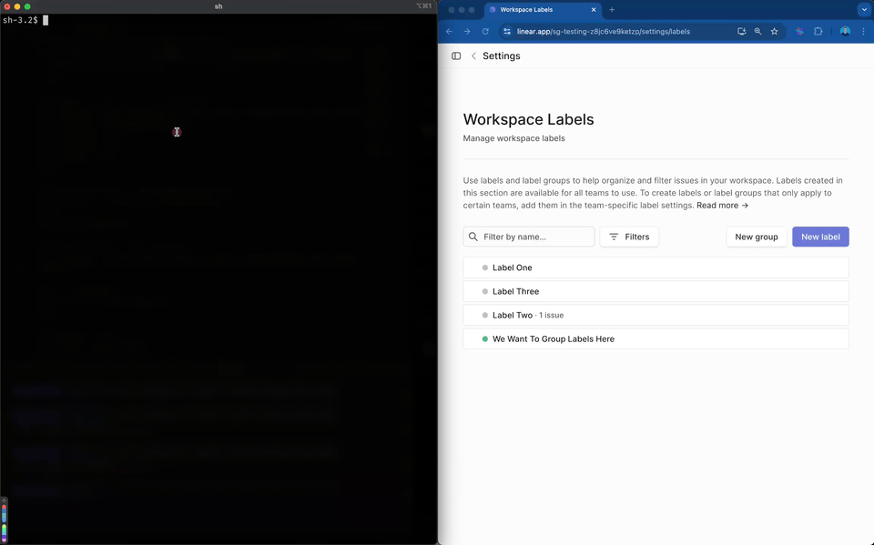

[Linear.app](https://linear.app) toolbelt for those more at home on the command line.

## About
A simple CLI to help (me) manage some annoyingly manual tasks on Linear.

Originally created because using the UI to convert prefix-labels to a group 1 by 1...


## How to use

> Note: I'll add builds & releases soon. For now, you'll need to build from source yourself.

First we build the `clinear` binary.
```bash
mise install
bun install
bun build ./src/index.ts --compile --outfile dist/clinear
```

Then run it with `./dist/clinear` or add the binary to your `PATH`.


Instructions for creating a Linear API key can be found [here](https://developers.linear.app/docs/graphql/working-with-the-graphql-api#personal-api-keys). You can either supply a Linear API key with the `--api-key` flag or create a `.env` file with the `LINEAR_API_KEY` variable. 

## Features
- [x] Find and select labels to move to a group/parent-label
- [x] Modify label names in bulk
  - Casing
  - Pattern match & replace
- [ ] Anything else annoying
- [ ] Great suggestions / PRs 😊

### Demos
Rename labels


Group labels
